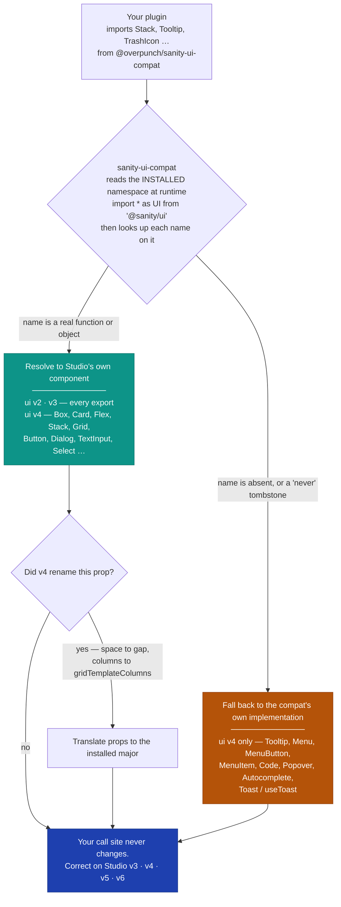

# @overpunch/sanity-ui-compat

[](https://www.npmjs.com/package/@overpunch/sanity-ui-compat)
[](#compatibility)
[](#compatibility)
[](#compatibility)
[](#license)

Version-agnostic access to `@sanity/ui` and `@sanity/icons` across Sanity Studio v3–v6.

**One import, one prop spelling, four Studio majors.** Write
`import { Stack, Tooltip } from '@overpunch/sanity-ui-compat'` once and the same
plugin build loads in a Sanity 3 Studio and a Sanity 6 Studio — no version detection
at your call sites, no `@sanity/ui` in your bundle, no peer-range gymnastics.

This is the layer that lets every plugin in `tools/sanity-tools` span v3–v6 from a
single build. **18 packages in the suite depend on it.**

---

## Install

```bash
npm install @overpunch/sanity-ui-compat
```

Take it as a plain **`dependency`**, not a `peerDependency` — see [Usage](#usage) for why.
You almost certainly already have the peers, because your Studio installed them:

| Peer | Range | Where it comes from |
|---|---|---|
| `@sanity/ui` | `>=2 <5` | a transitive dep of `sanity` |
| `@sanity/icons` | `>=2 <6` | a transitive dep of `sanity` |
| `react` | `>=18` | a transitive dep of `sanity` |

There is deliberately **no `sanity` peer**. This package never imports `sanity` — it
only touches the two UI packages — so constraining the Studio itself would be a
promise it does not need to make.

---

## Compatibility

The two numbering systems in this README are not a typo, and this table is the key
that connects them. **Studio majors and `@sanity/ui` majors move independently:**

| Sanity Studio | ships `@sanity/ui` | ships `@sanity/icons` | Supported |
|---|---|---|---|
| **v3** (`3.99.0`) | `^2.16.4` | `^3.7.4` | ✅ |
| **v4** (`4.22.1`) | `^3.1.11` | `^3.7.4` | ✅ |
| **v5** (`5.31.2`) | `^3.2.0` | `^3.7.4` | ✅ |
| **v6** (`6.10.1`) | `^4.0.3` | `^5.2.1` | ✅ |

<sub>Resolved from each Studio major's published `dependencies` at the time of writing.</sub>

So the four Studio majors this package supports are covered by only **three**
`@sanity/ui` majors — 2, 3 and 4 — and exactly **two** `@sanity/icons` majors, 3 and 5.

### The `@sanity/ui` peer says `>=2 <5`. That is correct, not a bug.

This is the single most reported-looking thing in the package, so to be explicit:

> **Studio v6 ships `@sanity/ui` v4, not v5.** `@sanity/ui` v5 does not exist at the
> time of writing. A peer of `>=2 <5` therefore covers every Studio from v3 through
> v6 with room to spare, and capping below a hypothetical v5 is the *conservative*
> choice — a future `@sanity/ui` v5 would be exactly the kind of barrel reshuffle
> this package exists to absorb, and it should not be silently assumed compatible.

The same reasoning applies to `@sanity/icons` `>=2 <6`: v5 is what Studio v6 ships,
and v6 of the icons package is not assumed.

---

## The problem this solves

`@sanity/ui` v4 and `@sanity/icons` v5 emptied their barrels. Nine exports moved to
subpath entry points (`@sanity/ui/tooltip`, `@sanity/ui/menu`, …) and every named
`*Icon` export was replaced by `<Icon symbol="…">`.

The trap is that **both packages still declare the removed names in their `.d.ts`,
typed `never`**. So this:

```ts
import { Tooltip } from '@sanity/ui'
```

type-checks, builds, passes `tsc --noEmit`, passes `tsup` — and then the Studio
fails at runtime. Meanwhile the subpath form (`@sanity/ui/tooltip`) does not exist
on v2 or v3, so neither import shape works across the range we support.

This package reads the installed namespace at **runtime** and resolves each export
against whatever is actually there, falling back where it must. That is not a
stylistic choice; it is the only shape that links across v2 → v4.

---

## How it resolves



Three things follow from this shape, and they are the whole design:

1. **Resolution is by value, not by version sniffing.** Nothing reads a version
   string. A name is used if it is a function or a non-null object, and treated as
   absent otherwise — which is precisely how a `never` tombstone is caught.
2. **`@sanity/ui` is never bundled.** The host Studio's copy is the one that renders,
   so your plugin inherits the Studio's theme, layers and portalling for free.
3. **The fallbacks only ever run on the majors that need them.** On the Studio most
   people are on today, every component in the list above is Studio's real one.

---

## Usage

```ts
import { Stack, Card, Tooltip, MenuButton, useToast } from '@overpunch/sanity-ui-compat'
import { TrashIcon, UploadIcon } from '@overpunch/sanity-ui-compat/icons'
```

Take it as a plain **`dependency`**, not a `peerDependency`. It never bundles
`@sanity/ui` — it reads the host's — so duplicate copies in a tree are benign, and
pinning per plugin means you republish a plugin when you're editing it rather than
because a sibling moved.

### A complete tool, top to bottom

```tsx
import {
  Stack, Card, Flex, Text, Button, Tooltip, Progress,
  ActionMenu, ToastViewport, useToast,
} from '@overpunch/sanity-ui-compat'
import { RocketIcon, TrashIcon, EllipsisVerticalIcon } from '@overpunch/sanity-ui-compat/icons'

export function MyTool() {
  const toast = useToast()

  return (
    <Card padding={4}>
      {/* `space` is the v2/v3 spelling; it is translated to `gap` on v4 for you. */}
      <Stack space={4}>
        <Flex align="center" gap={3}>
          <Text weight="semibold">Batch rebuild</Text>
          <ActionMenu
            id="rebuild-menu"
            label="More actions"
            buttonIcon={EllipsisVerticalIcon}
            items={[
              { text: 'Clear cache', icon: TrashIcon, tone: 'critical', onClick: () => {} },
              { text: 'Open docs', icon: RocketIcon, href: 'https://example.com' },
            ]}
          />
        </Flex>

        <Progress value={42} label="Rebuild progress" />

        <Tooltip text="Starts immediately" placement="top">
          <Button
            text="Run"
            icon={RocketIcon}
            onClick={() => toast.push({ status: 'success', title: 'Started' })}
          />
        </Tooltip>
      </Stack>

      {/* Required for toasts to appear on @sanity/ui v4 — see below. */}
      <ToastViewport />
    </Card>
  )
}
```

### Mount `<ToastViewport />` if you call `useToast`

On `@sanity/ui` v2/v3 `useToast` is Studio's own hook and toasts appear in Studio's
own viewport — you need nothing else. On v4 the hook is gone from the barrel, so
this package supplies a local one, and **its toasts have nowhere to render unless
you mount `<ToastViewport />` somewhere in your tool.** It renders `null` outright
when Studio's toast system is available, so mounting it is always safe and never
double-renders.

This is the one case where the compat is not a pure drop-in, and it fails in the
quiet direction — `toast.push()` succeeds, nothing appears.

### `ActionMenu` is the preferred menu API

`Menu` / `MenuButton` / `MenuItem` exist and work, because 17 plugins already write
menus as nested JSX and rewriting them all is a bigger change than swapping an
import. But `ActionMenu` takes its rows as data, which means it can manage focus
without knowing anything about its children — no conditional or fragment-wrapped
child can desynchronise arrow-key order. **Prefer it in new code.**

---

## What you get

| Group | Exports | Behaviour on `@sanity/ui` v4 |
|---|---|---|
| **Primitives** (16) | `Box` `Card` `Flex` `Text` `Heading` `Label` `Spinner` `Button` `TextInput` `Select` `Switch` `Dialog` `Checkbox` `Radio` `TextArea` `Container` | All still on the barrel — Studio's own, passed straight through. A plain-DOM fallback exists per name but is currently unused. |
| **Prop-translating** (4) | `Stack` `Inline` `Grid` `Badge` | Studio's own component, with [renamed props translated](#silent-renames-it-absorbs). |
| **Off the barrel on v4** (9) | `Tooltip` `Menu` `MenuButton` `MenuItem` `Code` `Autocomplete` `useToast` — plus `ActionMenu` and `ToastViewport`, which are this package's own APIs throughout | Relocated to subpaths upstream, so this package's own implementation renders. |
| **Owned outright** (1) | `Progress` | Never existed upstream on any major. Always this package's. |
| **Hook** (1) | `usePrefersDark` | Studio's if present, media-query fallback otherwise. |
| **Icons** (52) | `TrashIcon` `UploadIcon` `RocketIcon` … from `/icons` | Named export on icons v2–v4; `<Icon symbol="…">` on v5+. |
| **Escape hatches** (6) | `UI` `ICONS` `resolveComponent` `resolveFunction` `resolveRecord` `STACK_USES_GAP` | — |

Need something outside the curated surface? Reach for the escape hatches rather than
forking or importing `@sanity/ui` directly — a direct named import is exactly what
breaks on v4:

```ts
import { UI, resolveComponent } from '@overpunch/sanity-ui-compat'
import { resolveIcon } from '@overpunch/sanity-ui-compat/icons'

const Popover = resolveComponent(UI, 'Popover')      // undefined on v4
const PinIcon = resolveIcon('PinIcon', 'pin')        // named on v3, symbol on v5
```

---

## Silent renames it absorbs

v4 renamed or removed 20 props and **ignores the old names at runtime** rather than
warning. Wrong guess = collapsed layout, no error. Call sites measured across
`tools/sanity-tools` when this was written:

| Old | New on v4 | Sites |
|---|---|---|
| `Stack space` | `gap` | 298 |
| `Grid columns` | `gridTemplateColumns` | 48 |
| `Badge mode` | *removed entirely* | 12 |
| `Inline space` | `gap` | 5 |

Pass the **old** names to this package's `Stack`, `Grid`, `Inline` and `Badge`; it
translates per installed major.

Translation runs **both ways**, so a call site that already spells a prop the v4 way
is equally correct — `<Stack gap={3}>` and `<Stack space={3}>` produce identical
output on every supported major. Neither spelling has to be rewritten.

---

## Two upstream bugs it papers over — deliberately

Both predate v6 and were found while verifying this package.

- **`Progress` has never existed in `@sanity/ui`** — not in v2.8.9, v3.1.14 or
  v4.0.5. `sanity-delete-unused-assets` and `sanity-export-data` both import it and
  render it conditionally, so it only crashes once a scan is running. This package
  ships a real one.
- **`DuplicateIcon` has never existed in `@sanity/icons`** — absent from v3.8.0's
  named exports and from v5.2.1's 236-key symbol map. Mapped to `copy` here.

---

## Known limitation: `Autocomplete` on v4

On v2/v3 you get Studio's real combobox. On v4 you get a `TextInput` + native
`<datalist>` — `renderOption` and `filterOption` are ignored. A correct ARIA 1.2
combobox is a large piece of work and a half-correct one is worse than an honest
plain input. Check whether your plugin actually needs combobox behaviour before
shipping it on a v4 Studio.

---

## Verifying

```bash
npm run verify      # typecheck + build + probe + smoke
```

Or individually:

| script | what it proves |
|---|---|
| `typecheck` | types line up. Necessary, **not** sufficient — see the trap above |
| `probe` | every export *binds* to something real against the installed majors |
| `smoke` | the fallbacks actually **render**, and translated props reach the DOM |

### Why this chain exists

Because **the entire bug class this package addresses is invisible to `tsc` and to
the build.** That is not a slogan; it is the literal mechanism described at the top
of this README. `@sanity/ui` v4 and `@sanity/icons` v5 still *declare* their removed
names, typed `never`. A named import of a component that no longer exists:

- passes `tsc --noEmit` ✅
- passes `tsup` ✅
- emits a clean bundle ✅
- explodes in the Studio ❌

A green build is therefore **worth nothing** as evidence here. Every stage after
`typecheck` exists to test something the compiler structurally cannot see:

- **`probe`** imports the built `dist/` against the real installed `@sanity/ui` and
  `@sanity/icons` and asks, of every primitive, wrapper and icon it exports, *did
  this bind to an actual value?* It catches a name that resolved to a tombstone, a
  primitive that silently
  degraded to a plain `<div>`, and — by cross-checking the icon table against v5's
  live 236-key symbol map — a glyph that would have rendered blank.
- **`smoke`** goes one level further and actually **server-renders** each fallback
  through `react-dom/server`, asserting on the emitted HTML: that `Progress` carries
  `role="progressbar"` and `aria-valuenow`, that `Tooltip` keeps its children when
  handed `content`/`placement`/`portal`, that `Grid` produces byte-identical output
  for `gap` and `space`, and that **neither prop name leaks to the DOM as a stray
  attribute**.

`smoke` is the one that catches real regressions. Both defects found by the first
adoption pass — a narrowed `Tooltip` silently dropping `content`/`placement`, and
`Grid` missing `gap` — were invisible to `tsc` **and** to `probe`, and both are now
covered. It also caught that real `@sanity/ui` components throw outright without a
`ThemeProvider`, which is why the harness supplies one.

The dev dependencies are pinned to `@sanity/ui@^4` and `@sanity/icons@^5` on purpose:
that is the **hard case**, the combination where the most exports are missing and the
most fallbacks run. Verifying against v2/v3 would exercise almost none of this code.

Last run, against `@sanity/ui` 4.0.5 + `@sanity/icons` 5.2.1 (the hard case):

```
STACK_USES_GAP = true          primitives falling back to DOM: none
wrapper exports present: 14/14 icons exported: 53
symbol table rows: 52          symbols absent from v5 map: none
icons resolving to MissingIcon: none
20/20 render checks passed
```

**Still not proven.** These render through `react-dom/server` in Node, not in a
Studio. Server rendering cannot exercise hover, keyboard focus, portalling or
layer stacking — so the fallback `Tooltip`'s placement, the fallback menu's roving
focus and Escape handling, and whether either sits *above* a Studio dialog remain
unverified. Those need `test-studio` on Sanity 6.

To be plain about the evidence behind "supports v3–v6": it rests on the peer ranges
above, a green `verify` against the hardest dependency combination, and adoption
across three in-house Studios. **It has not been exercised in a running Sanity 6
Studio beyond those.** If you hit something on v6, that is a genuinely useful report
rather than a surprising one.

---

## Status

`0.x` until the composable `Menu`/`MenuButton`/`MenuItem` trio and `Progress` have
run in a real Studio. The trio's fallback drives focus by querying the live DOM for
`[role="menuitem"]` rather than by child registration, so conditional or fragment-
wrapped children cannot desynchronise arrow-key order — that is the part most
deserving of test coverage.

---

## Who uses it

18 packages in [`tools/sanity-tools`](https://github.com/Liiift-Studio/liiift-sanity-tools)
take this as a dependency, including `sanity-font-uploader`, `sanity-typeface-seo`,
`sanity-studio-version-badge`, `sanity-search-and-delete`, `sanity-detect-languages`
and `sanity-advanced-reference-array`.

If you are adding a new plugin to that suite: import UI from here, not from
`@sanity/ui`. That is the entire adoption rule.

---

## License

[MIT](LICENSE).

The problem this solves is not specific to one foundry — any plugin author supporting
more than one Sanity Studio major hits the same emptied barrels and the same `never`
tombstones. Use it freely.

Do note the API is still `0.x` and moves with the suite's needs; pin a version if that
matters to you.

**Repository:** [Liiift-Studio/liiift-sanity-tools](https://github.com/Liiift-Studio/liiift-sanity-tools)
· package path `sanity-ui-compat/`
